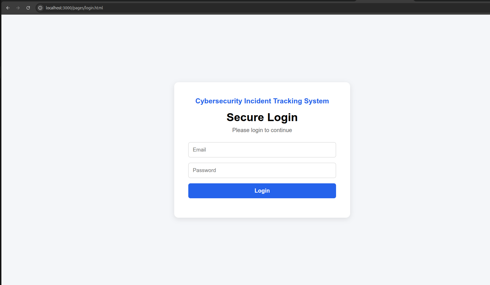
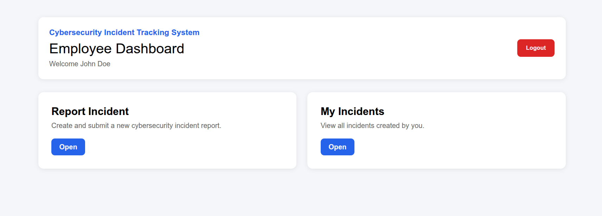
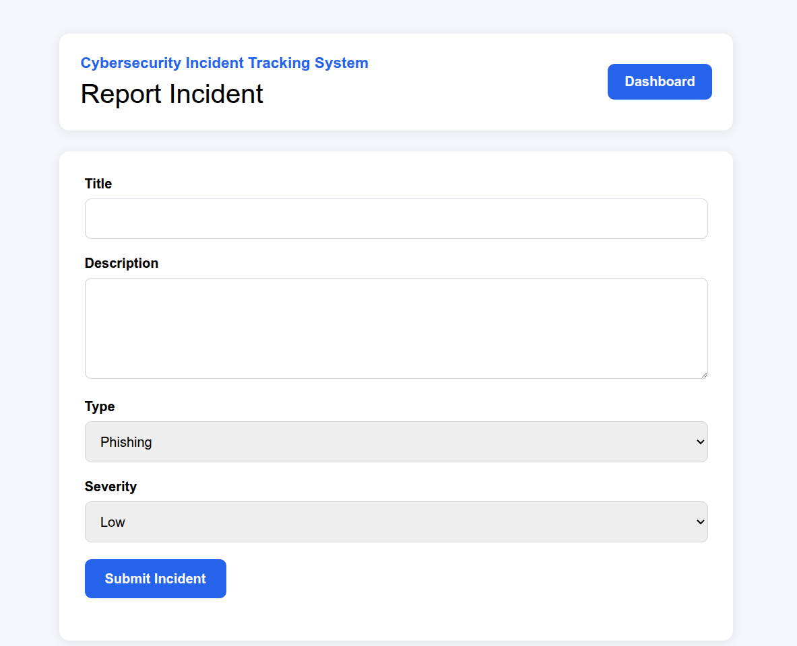
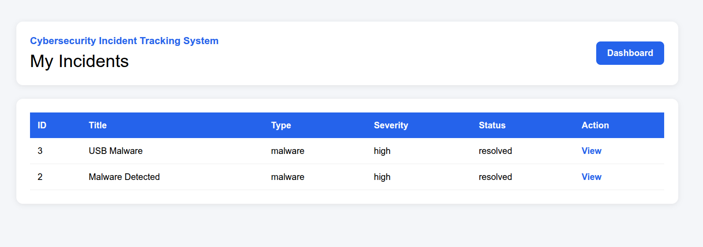
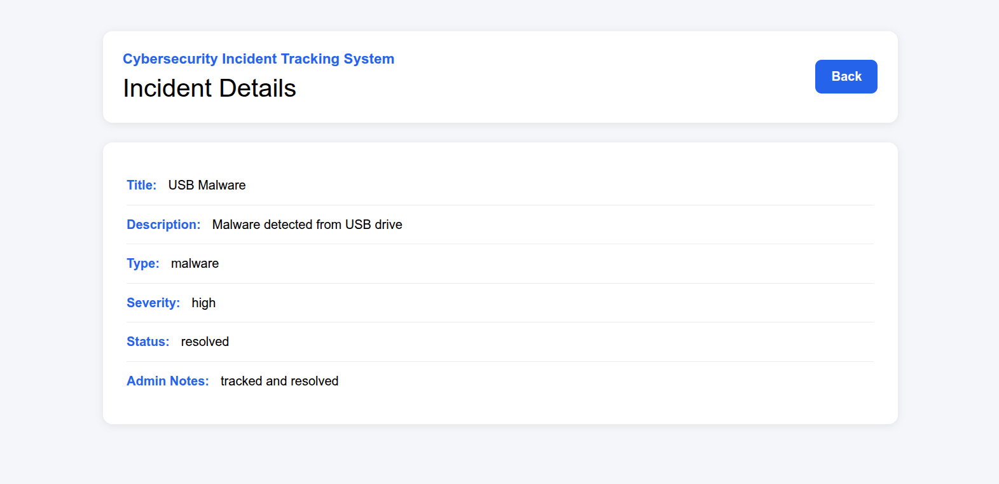
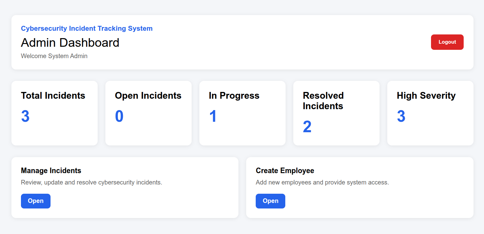
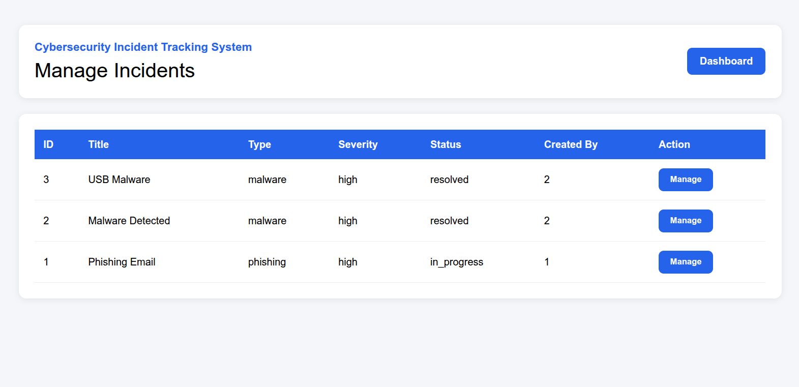
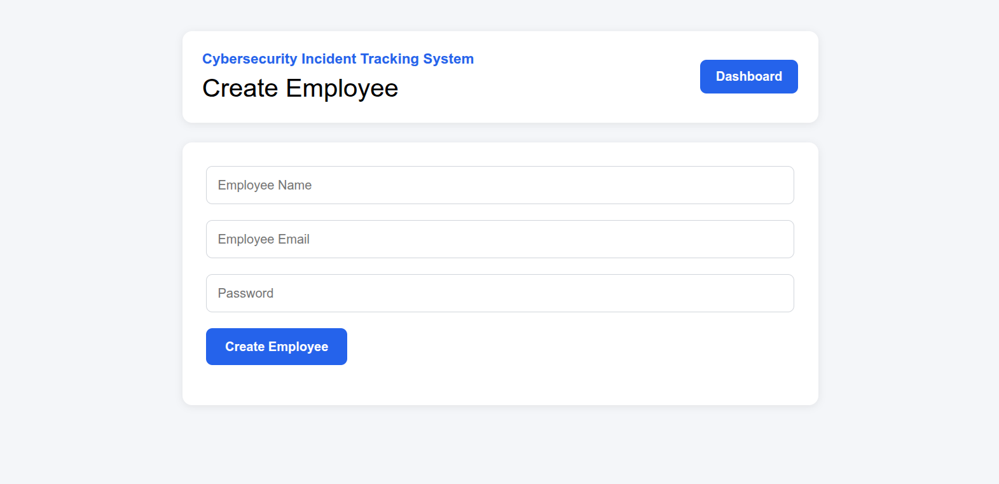

# Cybersecurity Incident Tracking System

A full-stack web application designed to help organizations report, track, manage, and resolve cybersecurity incidents efficiently.

The system provides dedicated dashboards for Employees and Administrators. Employees can report cybersecurity incidents and track their status, while Administrators can monitor incidents, update statuses, add investigation notes, and manage employee accounts.

---

# Features

## Authentication & Authorization

- JWT-based Authentication
- Secure Password Hashing using bcryptjs
- Role-Based Access Control (RBAC)
- Protected API Routes

## Employee Features

- Secure Login
- Report Cybersecurity Incidents
- View Submitted Incidents
- View Incident Details
- Track Incident Status
- View Admin Investigation Notes

## Admin Features

- Secure Admin Login
- Dashboard Statistics
- View All Incidents
- Update Incident Status
- Add Administrative Notes
- Create Employee Accounts
- Monitor High Severity Incidents
- Track Open, In Progress, and Resolved Incidents

---

# Tech Stack

| Layer                     | Technology                      |
| ------------------------- | ------------------------------- |
| Backend                   | Node.js, Express.js             |
| Database                  | PostgreSQL                      |
| Frontend                  | HTML5, CSS3, Vanilla JavaScript |
| Authentication            | JWT (JSON Web Token)            |
| Password Hashing          | bcryptjs                        |
| Environment Configuration | dotenv                          |
| Database Driver           | pg                              |
| API Security              | Middleware-Based Authorization  |
| Development Tool          | nodemon                         |
| Cross-Origin Support      | cors                            |

---

# Libraries & Dependencies

## Production Dependencies

- express
- pg
- jsonwebtoken
- bcryptjs
- dotenv
- cors

## Development Dependencies

- nodemon

---

# Project Architecture

This project follows a layered architecture:

```text
Client (HTML/CSS/JS)
        |
        v
Routes
        |
        v
Controllers
        |
        v
Services
        |
        v
Repositories
        |
        v
PostgreSQL Database
```

### Architectural Components

- Routes define API endpoints
- Controllers process incoming requests
- Services contain business logic
- Repositories communicate with PostgreSQL
- Middleware handles authentication and authorization

---

# Project Structure

```text
incident-tracker
│
├── public
│   ├── js
│   │   ├── admin.js
│   │   ├── auth.js
│   │   └── employee.js
│   │
│   └── pages
│       ├── login.html
│       ├── employee-dashboard.html
│       ├── admin-dashboard.html
│       ├── admin-incidents.html
│       ├── create-employee.html
│       ├── report-incident.html
│       ├── my-incidents.html
│       └── incident-details.html
│
├── src
│   ├── config
│   │   └── db.js
│   │
│   ├── controllers
│   ├── middleware
│   ├── repositories
│   ├── routes
│   └── services
│
├── screenshots
├── database.sql
├── index.js
├── package.json
├── package-lock.json
└── README.md
```

---

# Screenshots

## Login Page



## Employee Dashboard



## Report Incident



## My Incidents



## Incident Details



## Admin Dashboard



## Manage Incidents



## Create Employee



---

# Installation

## 1. Clone Repository

```bash
git clone https://github.com/Sanit-Kumar/incident-tracker.git

cd incident-tracker
```

## 2. Install Dependencies

```bash
npm install
```

## 3. Create Environment File

Create a `.env` file in the project root.

```env
PORT=3000

DB_HOST=localhost
DB_PORT=5432

DB_NAME=incident_tracker
DB_USER=postgres
DB_PASSWORD=your_password

JWT_SECRET=your_secret_key
```

## 4. Create Database

```sql
CREATE DATABASE incident_tracker;
```

## 5. Import Database Schema

```bash
psql -U postgres -d incident_tracker -f database.sql
```

## 6. Start PostgreSQL

Ensure PostgreSQL is running before starting the application.

## 7. Run Application

Development Mode:

```bash
npx nodemon index.js
```

Production Mode:

```bash
node index.js
```

---

# Application Workflow

## Employee Workflow

```text
Login
   ↓
Employee Dashboard
   ↓
Report Incident
   ↓
Track Incident Status
   ↓
View Admin Notes
```

## Admin Workflow

```text
Login
   ↓
Admin Dashboard
   ↓
Manage Incidents
   ↓
Update Status
   ↓
Add Notes
   ↓
Resolve Incident
```

---

# API Endpoints

## Authentication

```http
POST /api/auth/login
```

## Employee APIs

```http
POST /api/incidents
GET  /api/incidents/my
GET  /api/incidents/:id
```

## Admin APIs

```http
GET   /api/admin/incidents
PATCH /api/admin/incidents/:id
GET   /api/admin/stats
POST  /api/admin/users
```

---

# Database Schema

## Users Table

```text
id
name
email
password
role
created_at
```

## Incidents Table

```text
id
title
description
type
severity
status
admin_notes
created_by
created_at
updated_at
```

---

# Learning Outcomes

This project demonstrates:

- REST API Development
- PostgreSQL Integration
- JWT Authentication
- Authorization & RBAC
- Middleware Implementation
- Layered Backend Architecture
- Full-Stack Application Development
- Frontend and Backend Integration
- Incident Management Workflow Design
- Secure User Authentication
- Professional Dashboard Design

---

# Future Improvements

- Email Notifications
- Incident Search & Filters
- Incident Assignment System
- Audit Logging
- Analytics Dashboard
- Two-Factor Authentication (2FA)
- Real-Time Notifications

---

# Author

**Sanit Kumar Amartya**

Cybersecurity Incident Tracking System built using Node.js, Express.js, PostgreSQL, JWT Authentication, and Vanilla JavaScript.
